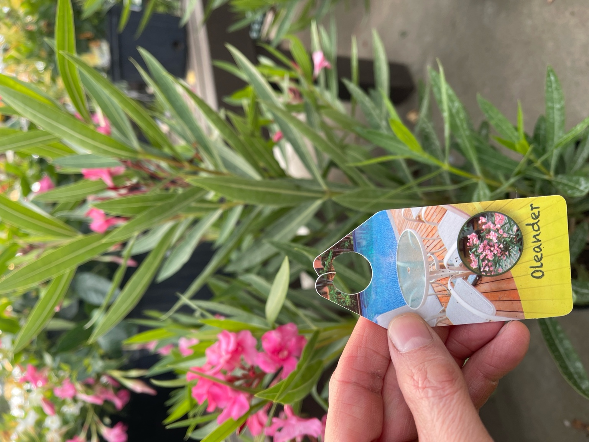

## Running list of things GPT knows that surpised me

__User__:
What’s the Stravinsky piece that starts with a simple melody played on oboe?

__ChatGPT__:
The piece you're referring to is likely "The Rite of Spring" by Igor Stravinsky. It opens with a famous solo for bassoon, not oboe, which is often played in a very high register making it sound somewhat like an oboe. This solo introduces the opening section of the ballet, setting a primitive and ritualistic tone for the entire work.

---

__User__:
What's used as divider in jekyll markdown?

__ChatGPT__:
In Jekyll Markdown, you can create a horizontal divider or rule by using three or more hyphens (---)

--- 

__User__:
What are the three ways discussed in The Phoenix Project and who said them? Be concise.

__ChatGPT__:
In "The Phoenix Project," the Three Ways are discussed by Erik, who introduces and explains them to Bill, the protagonist. The Three Ways are:

1. The First Way: Systems Thinking - Focus on the entire system’s flow of work.
2. The Second Way: Amplify Feedback Loops - Ensure feedback loops are in place to correct and improve processes.
3. The Third Way: Culture of Continual Experimentation and Learning - Encourage continuous experimentation, learning from failures, and understanding that repetition and practice are the prerequisites to mastery.

---

__User__: Tell me about these. Do they produce lots of flowers?

__ChatGPT__:
Oleander plants, like the one shown in your photo, are well-known for their ability to produce a lot of flowers. These plants bloom prolifically from late spring through fall, offering a continuous display of flowers. Oleander flowers can be pink, red, white, or yellow and are quite striking.

However, it's important to note that every part of the oleander plant is toxic if ingested, so it should be handled with care, especially around children and pets. The plant is quite hardy, tolerating drought, heat, and various soil types, making it a popular choice for landscapes and outdoor areas. Proper care includes full sun exposure and regular watering for optimal blooming.