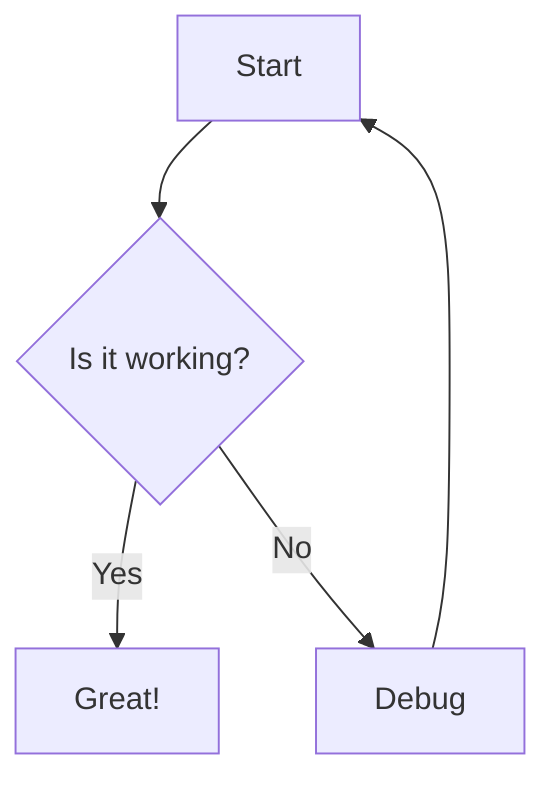

## About

Pretty Markdown is a full-featured markdown editor and renderer that provides a split-pane interface for writing and previewing markdown content in real-time.

## Features

- **Live Preview**: See your markdown rendered instantly as you type
- **Syntax Highlighting**: Code blocks are beautifully highlighted
- **Mermaid Diagrams**: Create flowcharts, sequence diagrams, and more
- **Collapsible Sidebar**: Maximize your workspace when needed
- **Clean Interface**: Distraction-free writing experience
- **Responsive Design**: Works on desktop and mobile devices

## How to Use

1. Click the "Launch Pretty Markdown" button above
2. Type or paste your markdown in the left editor pane
3. See the live preview on the right
4. Use the sidebar toggle to collapse/expand the file list (if applicable)

## Supported Markdown

Pretty Markdown supports all standard markdown features including:

- Headers (h1-h6)
- Bold, italic, strikethrough
- Links and images
- Lists (ordered and unordered)
- Code blocks with syntax highlighting
- Tables
- Blockquotes
- Horizontal rules

## Mermaid Diagrams

Create beautiful diagrams using Mermaid syntax:

## Technical Details

Built with:
- [Marked.js](https://marked.js.org/) for markdown parsing
- [Mermaid](https://mermaid.js.org/) for diagram rendering
- Pure JavaScript, HTML, and CSS - no build step required
- Fully self-contained in a single HTML file
